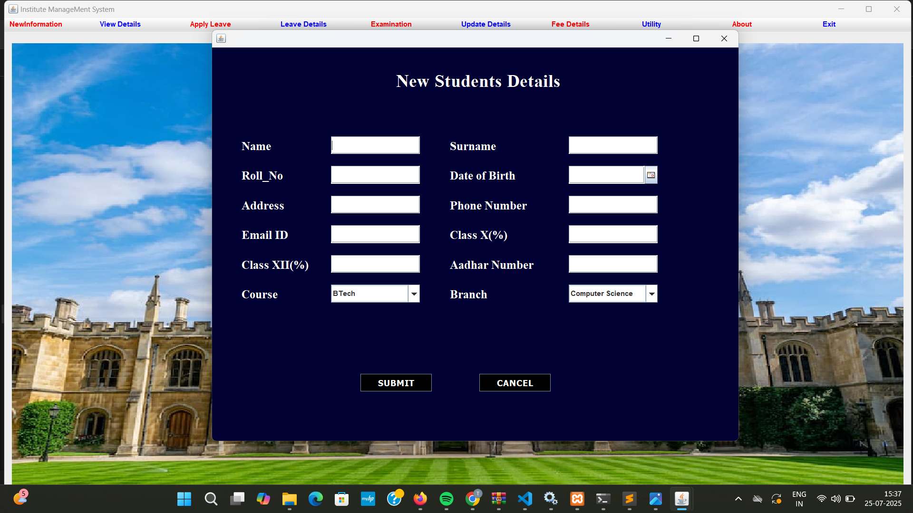
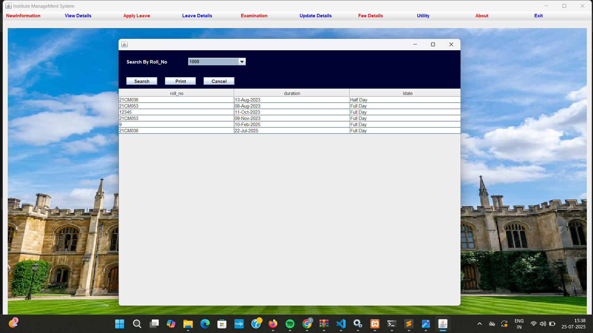

# 🎓 Institute Management System (Java Desktop Software)

A Java-based application to manage key operations of an educational institute — including student records, faculty info, leave tracking, exam details, and fee management.

---

## 🧰 Technologies Used

| Technology | Purpose                     |
|------------|-----------------------------|
| Java       | Core Programming Language   |
| Swing / AWT (Optional) | GUI Interface (if used) |
| File Handling / MySQL (if used) | Data Storage         |
| IDE        | Visual Studio / Eclipse / NetBeans |

---

## 📌 Core Features

### 👤 Faculty Module
- Add / Update Faculty Information
- View Faculty Details
- Apply for Leave

### 👨‍🎓 Student Module
- Add / Update Student Records
- View Student Details
- View Exam & Fee Details

### 📝 Leave Management
- Apply for Leave
- View Leave Status and History

### 🧾 Examination
- Add Exam Info
- View Marks / Results

### 💰 Fee Details
- Enter / Update Fees
- View Payment Status

### 🧰 Utility
- Reset / Backup / Exit System

- ## 📸 Screenshots

### 🏠 Home Page

### 👩‍🏫 Teacher Details

### 📝 Apply Student Leave

### 💰 Fee Structure

### ✅ Fee Payment

